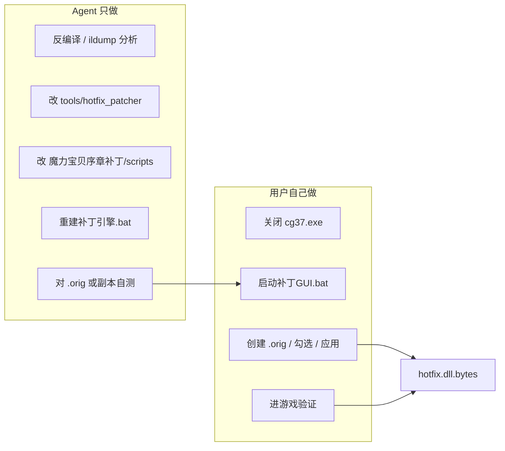
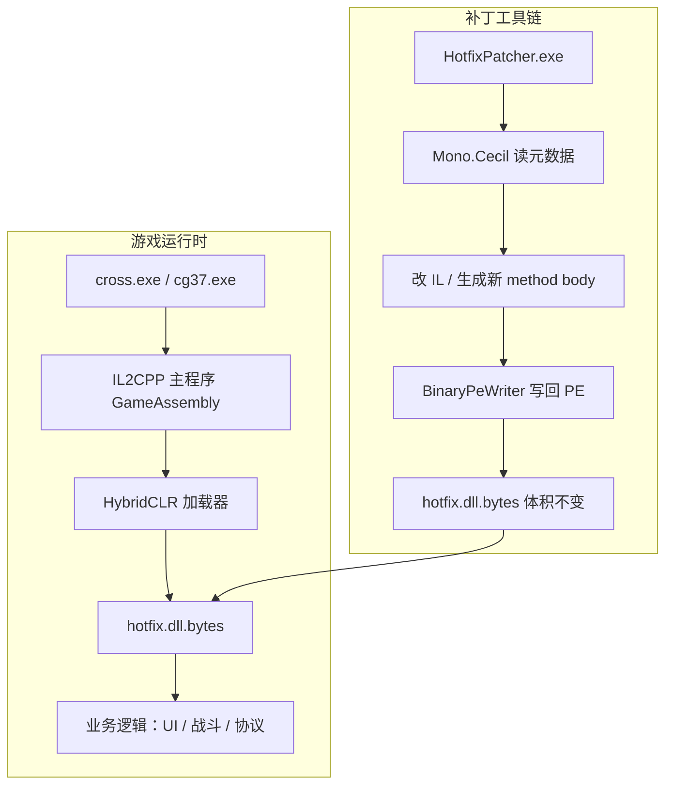

# 魔力宝贝：序章 — 客户端热补丁开发指南

> 本文档由 **Crossgate（cross.exe / cross_Data）** 项目的 GUI 补丁实战经验整理而来，供在 **魔力宝贝：序章（cg37 / cg37_Data）** 上继续开发的 Agent 使用。  
> 两作客户端资源路径、类名、方法体可能不同，但 **HybridCLR + hotfix.dll.bytes + 二进制 IL 补丁** 的整体架构高度相似。

**参考工程（已验证）**：`E:\crossgate_cursor`  
**本文档位置**：`E:\cross\魔力宝贝：序章\客户端热补丁开发指南.md`  
**用户打补丁入口**：`魔力宝贝序章补丁/启动补丁GUI.bat`（Agent **不**直接改游戏 hotfix）

---

## 0. 统一工作流（Agent / 用户）



| 角色 | 做什么 | 不做什么 |
|------|--------|----------|
| **Agent** | 维护 GUI + HotfixPatcher；文档与 Cursor 规则 | **不写** `cg37_Data/.../hotfix.dll.bytes` |
| **用户** | 用 GUI 应用 / 还原补丁 | — |

Cursor 规则：`.cursor/rules/seqchapter-patch-gui.mdc`（`alwaysApply`）

---

## 目录

1. [架构总览](#1-架构总览)
2. [序章 vs Crossgate 差异对照](#2-序章-vs-crossgate-差异对照)
3. [第一步：定位 hotfix 与建立 .orig 备份](#3-第一步定位-hotfix-与建立-orig-备份)
4. [反编译与代码阅读](#4-反编译与代码阅读)
5. [铁律：为什么不能直接 Cecil Write](#5-铁律为什么不能直接-cecil-write)
6. [二进制 IL 补丁流水线（不崩溃的核心）](#6-二进制-il-补丁流水线不崩溃的核心)
7. [补丁模式与代码模板](#7-补丁模式与代码模板)
8. [GUI 补丁工具架构](#8-gui-补丁工具架构)
9. [新增一种补丁的完整清单](#9-新增一种补丁的完整清单)
10. [调试、验证与常见故障](#10-调试验证与常见故障)
11. [已验证补丁案例速查](#11-已验证补丁案例速查)
12. [参考文件索引](#12-参考文件索引)

---

## 1. 架构总览



| 层级 | Crossgate | 魔力宝贝：序章（待确认路径） |
|------|-----------|------------------------------|
| 游戏根目录 | `cross.exe` + `cross_Data/` | `cg37.exe` + `cg37_Data/` |
| 热更程序集 | `cross_Data/assets/hotfixdata/hotfix.dll.bytes` | 通常在 `cg37_Data/assets/.../hotfix.dll.bytes`（需从 AssetBundle 解出） |
| 框架 DLL | `moli.dll.bytes` | 同样有 `Moli.dll`（见 `ScriptingAssemblies.json`） |
| 运行时 | HybridCLR | HybridCLR（`ScriptingAssemblies.json` 含 `Hotfix.dll`、`Hotfix.Core.dll`） |

**结论**：优先改 **hotfix.dll.bytes**，不要动 IL2CPP 主程序；服务端协议层可沿用 Crossgate 经验，但 **类名、字段名、协议枚举必须在本客户端反编译结果里核对**。

---

## 2. 序章 vs Crossgate 差异对照

| 项目 | Crossgate | 魔力宝贝：序章 |
|------|-----------|----------------|
| Data 目录 | `cross_Data` | `cg37_Data` |
| 主程序集名 | 可能为 `cross.exe` | `cg37.exe` |
| hotfix 期望体积（Crossgate 实测） | **6,355,968** 字节 | **必须在本客户端首次测量后写入 `EXPECTED_SIZE`** |
| GUI 补丁包 | `Crossgate客户端补丁/` | **`魔力宝贝序章补丁/`**（用户唯一入口） |
| 反编译产出 | `tools/hotfix_ilspy/*.cs` | 需为本游戏重新导出一份 `hotfix_ilspy/` |

**ScriptingAssemblies.json（序章已确认）** 路径：

```
E:\cross\魔力宝贝：序章\cg37_Data\ScriptingAssemblies.json
```

其中包含 `Hotfix.dll`、`Hotfix.Core.dll`、`Moli.dll`，说明热更架构一致。

---

## 3. 第一步：定位 hotfix 与建立 .orig 备份

### 3.1 查找 hotfix.dll.bytes

在 `cg37_Data` 下搜索：

```powershell
Get-ChildItem -Path "E:\cross\魔力宝贝：序章\cg37_Data" -Recurse -Filter "hotfix.dll.bytes" -ErrorAction SilentlyContinue
Get-ChildItem -Path "E:\cross\魔力宝贝：序章\cg37_Data" -Recurse -Filter "*.dll.bytes" -ErrorAction SilentlyContinue
```

若只有 `.b` 资源包、没有明文 `hotfix.dll.bytes`，需要：

1. 用 UnityPy / 现有解包脚本从 `assets/*.b` 提取；
2. 或对比 Crossgate 的 `hotfixdata` 目录结构在序章里找同名路径。

### 3.2 备份原版（必做）

```powershell
# 假设 hotfix 路径为 HOTFIX_PATH
Copy-Item HOTFIX_PATH HOTFIX_PATH.orig
```

**所有补丁脚本都以 `.orig` 为干净底稿**；组合补丁可选「从 .orig 恢复后再叠加」。

### 3.3 记录关键常量

找到 hotfix 后立刻记录：

```python
EXPECTED_SIZE = <文件字节数>   # 例如 Crossgate 为 6_355_968
HOTFIX_REL = r"cg37_Data\assets\hotfixdata\hotfix.dll.bytes"  # 以实际路径为准
```

写入 `patch_common.py` 的 `EXPECTED_SIZE` 与 `hotfix_path()`。

---

## 4. 反编译与代码阅读

### 4.1 推荐工具链

| 工具 | 用途 | 命令/用法 |
|------|------|-----------|
| **dnSpy / dnSpyEx** | 图形化浏览 hotfix，看 IL、字符串、调用关系 | 直接打开 `hotfix.dll.bytes`（PE 格式） |
| **ilspycmd** | 批量导出 C# 到目录 | `ilspycmd hotfix.dll.bytes -o hotfix_ilspy` |
| **HotfixPatcher ildump** | 快速看单个方法 IL | 见下文 |
| **dnfile（Python）** | 无 .NET SDK 时导出类型存根 | 产出 `hotfix_stubs.cs` |

Crossgate 工程内已有：

- `E:\crossgate_cursor\tools\hotfix_ilspy\` — 完整反编译 C#（面板、协议、Manager）
- `E:\crossgate_cursor\tools\hotfix_decompiled\hotfix_stubs.cs` — 类型/方法签名存根
- `E:\crossgate_cursor\tools\DECOMPILE_REPORT.md` — 反编译过程记录

**序章 Agent 应做的第一件事**：对序章自己的 `hotfix.dll.bytes` 跑同样流程，生成 `hotfix_ilspy/`，不要直接照搬 Crossgate 类名。

### 4.2 用 HotfixPatcher 导出 IL（开发必备）

编译 patcher 后：

```bat
dotnet build E:\crossgate_cursor\tools\hotfix_patcher\HotfixPatcher.csproj -c Release

HotfixPatcher ildump "路径\hotfix.dll.bytes" MapSidebarPanel.OnClickOfflineTradeCallback
HotfixPatcher ildump "路径\hotfix.dll.bytes" BattleManager.get_BattleTimeScale
```

实现见 `tools/hotfix_patcher/IlDump.cs`：按 `TypeName.MethodName` 打印每条指令的 Offset、OpCode、Operand。

### 4.3 如何找「要改哪里」

典型调研路径（以「秘阁按钮改开 GM 面板」为例）：

1. 在 `hotfix_ilspy` 搜索 UI 按钮字段：`m_Btn_OfflineTrade`、`OnClickOfflineTradeCallback`
2. 看回调里 `call` / `callvirt` 的目标面板：`UIManager.GetUIPanel<T>().Open()`
3. 确认目标面板类名：`GMToolsPanel`、`GMStorePanel` 等
4. 用 `ildump` 看当前方法体只有几条指令还是大段逻辑
5. 在同文件找 **可参考的 IL 样板**（例如侧栏里 `OnClickBlindboxDrawCallback`）

### 4.4 ref_stubs：让 Cecil 能解析 Unity 类型

hotfix 引用了 UnityEngine / UI 等程序集，但磁盘上往往没有完整 DLL。Crossgate 在 patcher 里放了最小 stub：

```
E:\crossgate_cursor\tools\hotfix_patcher\ref_stubs\
```

`Program.ResolveRefStubDirsPublic()` 会把该目录加入 `DefaultAssemblyResolver`，否则 Cecil 读 hotfix 会报找不到类型。

序章若 UI 框架相同，可复用；若有新程序集引用，按同样方式补 stub **空类即可**，只为满足元数据解析。

---

## 5. 铁律：为什么不能直接 Cecil Write

### 5.1 实测结论（Crossgate）

| 操作 | hotfix 体积 | 游戏表现 |
|------|-------------|----------|
| 原版 `.orig` | **6,355,968** | 正常 |
| Cecil `assembly.Write()` 无修改 roundtrip | **6,322,176** | **黑屏 / HybridCLR 加载失败** |
| Cecil 注入 Mod 后再 Write | **6,322,176** | 黑屏 |
| **二进制 IL 补丁**（只改 method body / RVA） | **6,355,968** | **正常** |

详见：`E:\crossgate_cursor\tools\CROSSGATE_MOD.md`

### 5.2 原因简述

HybridCLR 或游戏启动逻辑会校验 hotfix 包 **总大小、段布局或哈希**。Cecil 全量重写会：

- 压缩元数据堆、重排 section；
- 改变文件长度；
- 导致加载器拒绝加载 → 黑屏。

### 5.3 正确策略

```
读 hotfix → Cecil 仅在内存中改 IL → IlSerializer 序列化为 method body 字节
→ BinaryPeWriter 写回 PE（原地替换或 .text 尾部追加 + 改 MethodDef RVA）
→ 断言 len(out) == len(orig)
```

**绝对不要**对 hotfix 调用 `AssemblyDefinition.Write(path)` 作为最终产出。

---

## 6. 二进制 IL 补丁流水线（不崩溃的核心）

### 6.1 标准 Apply 流程（每个 *IlPatcher.cs 都遵循）

```csharp
// 伪代码 — 所有 IlPatcher 的共同骨架
public static void Apply(string sourcePath, string outputPath, ...)
{
    var origBytes = File.ReadAllBytes(sourcePath);
    if (origBytes.Length != ExpectedSize)
        throw new InvalidOperationException("体积不对，可能不是正确的 hotfix");

    var data = (byte[])origBytes.Clone();

    // 1. Cecil 读元数据（InMemory = true）
    using var asm = AssemblyDefinition.ReadAssembly(sourcePath, readerParams);

    // 2. 定位 Type / Method
    var method = asm.MainModule.Types.First(t => t.Name == "X")
        .Methods.First(m => m.Name == "Y" && m.HasBody);

    // 3. 从原始 PE 读出 method body 快照（含 header）
    var snapshot = ReadMethodBodyFromPe(origBytes, method.RVA);

    // 4. 用 ILProcessor 修改 method.Body（或整体替换指令）
    // ...

    // 5. 序列化 + 写回
    IlSerializer.RecalculateOffsets(method.Body);
    var newBody = IlSerializer.Serialize(method.Body, snapshot);
    BinaryPeWriter.ReplaceMethodBody(data, method.RVA, snapshot, newBody);

    // 6. 体积不变检查
    if (data.Length != ExpectedSize)
        throw new InvalidOperationException("二进制补丁改变了文件大小，已中止");

    File.WriteAllBytes(outputPath, data);
}
```

### 6.2 ReadMethodBodyFromPe

从 PE 文件按 **RVA** 读取方法头 + IL 字节（Tiny vs Fat header）：

```csharp
// 参考：BattleNavShowIlPatcher.cs / MigePanelIlPatcher.cs 末尾
private static byte[] ReadMethodBodyFromPe(byte[] pe, int rva)
{
    var off = PeLayout.RvaToOffset(pe, rva);
    var flags = pe[off];
    if ((flags & 0x3) == 0x2)  // Tiny
    {
        var codeSize = flags >> 2;
        var len = 1 + codeSize;
        // copy...
    }
    if ((flags & 0x3) == 0x3)  // Fat
    {
        var codeSize = BitConverter.ToInt32(pe, off + 4);
        var len = 12 + codeSize;
        // copy...
    }
    throw new InvalidOperationException($"未知 method header 0x{flags:X2}");
}
```

### 6.3 BinaryPeWriter.ReplaceMethodBody

```csharp
// tools/hotfix_patcher/BinaryPeWriter.cs（逻辑摘要）
public static void ReplaceMethodBody(byte[] pe, int oldRva, byte[] oldBodySnapshot, byte[] newBody)
{
    if (newBody.Length <= oldBodySnapshot.Length)
    {
        // 原地替换，多余部分清零
        var fileOff = PeLayout.RvaToOffset(pe, oldRva);
        Array.Copy(newBody, 0, pe, fileOff, newBody.Length);
        if (newBody.Length < oldBodySnapshot.Length)
            Array.Clear(pe, fileOff + newBody.Length, oldBodySnapshot.Length - newBody.Length);
    }
    else
    {
        // 新 IL 更长：追加到 .text 段 slack，并 PatchMethodRva
        var newRva = AppendToTextSlack(pe, newBody);
        PatchMethodRva(pe, oldRva, newRva);
    }
}
```

要点：

- **优先原地替换**（新 body ≤ 旧 body），最安全；
- 更长则写入 `.text` 尾部空闲区，更新元数据表中的 **Method RVA**；
- 可能需要 `GrowTextIntoTrailingSections` 扩大 `.text` VirtualSize（**文件总大小仍不变**）。

### 6.4 IlSerializer 与字符串 token

方法里若有 `ldstr`，字符串在 `#US` 堆里有 token。重写 IL 时：

- `IlSerializer.Serialize(body, origMethodBodySnapshot)` 可从 **原方法体按顺序复用 ldstr token**，避免破坏堆；
- 新增字符串需走 `UserStringHeap` 追加（见 `UserStringHeap.cs`），**顺序追加，不要覆写旧槽位**。

Crossgate Mod 注入经验：**勿用 SealHeapTail 覆写**，应在 `#US` 顺序末尾追加。

### 6.5 幂等 / SKIP

每个补丁应检测「是否已打过」：

```csharp
if (HasShowPatch(method)) {
    Console.WriteLine("[SKIP] 已是补丁状态");
} else {
    // 真正修改
}
```

避免重复打补丁导致 IL 错乱崩溃。

---

## 7. 补丁模式与代码模板

### 7.1 模式 A：改空方法 / 填 IL（显示隐藏按钮）

**案例**：`BattleNavShowIlPatcher` — `SetAdvancedVersion` 原本只有 `ret`，填入 `SetActive(true)`。

```csharp
// 核心：从同类型其它方法复制 callvirt 样板
var getGameObject = FindCallvirt(refMethod, "get_gameObject");
var setActive = FindGameObjectSetActive(refMethod);

il.Append(il.Create(OpCodes.Ldarg_0));
il.Append(il.Create(OpCodes.Ldfld, battleNavField));
il.Append(il.Create(OpCodes.Callvirt, module.ImportReference(getGameObject)));
il.Append(il.Create(OpCodes.Ldc_I4_1));
il.Append(il.Create(OpCodes.Callvirt, module.ImportReference(setActive)));
il.Append(il.Create(OpCodes.Ret));
```

参考：`E:\crossgate_cursor\tools\hotfix_patcher\BattleNavShowIlPatcher.cs`

### 7.2 模式 B：常量补丁（倍速、数值）

**案例**：`VipTimeScaleIlPatcher` — 找 `get_BattleTimeScale` 里的 `ldc.r4 1.5`，改成 `ldc.r4 5.0`。

要点：

- 用 `ildump` 确认原始常数值；
- 只改对应 `Instruction.Operand`，不重建整个方法；
- 若还需改 `NetManager.update` 里上报速度，**两个方法都要 patch**，且分别做 snapshot。

参考：`E:\crossgate_cursor\tools\hotfix_patcher\VipTimeScaleIlPatcher.cs`

### 7.3 模式 C：替换整个方法体（秘阁 / 按钮改面板）

**案例**：`MigePanelIlPatcher` — `MapSidebarPanel.OnClickOfflineTradeCallback`

**目标 IL 模式**（打开任意 UIPanel）：

```csharp
private static byte[] BuildOpenPanelBody(MethodDefinition callback, AssemblyDefinition asm,
    byte[] snapshot, string panelTypeName)
{
    var module = callback.Module;
    var body = callback.Body;
    body.Instructions.Clear();
    body.Variables.Clear();
    body.ExceptionHandlers.Clear();

    var il = body.GetILProcessor();
    var getUIPanel = module.ImportReference(FindGetUIPanel(asm, panelTypeName));
    var open = module.ImportReference(FindUIPanelOpen(asm));

    il.Append(il.Create(OpCodes.Call, getUIPanel));      // UIManager.GetUIPanel<T>()
    il.Append(il.Create(OpCodes.Callvirt, open));        // UIPanel.Open()
    il.Append(il.Create(OpCodes.Ret));
    body.MaxStackSize = 8;

    IlSerializer.RecalculateOffsets(body);
    return IlSerializer.Serialize(body, snapshot);
}
```

等价 C#：

```csharp
((UIPanel)UIManager.GetUIPanel<GMToolsPanel>()).Open();
```

**委托侧栏已有回调**（参数需 `this`）：

```csharp
// ldarg.0 + call MapSidebarPanel.OnClickBlindboxDrawCallback
private static byte[] BuildDelegateSidebarBody(..., string targetMethodName)
{
    il.Append(il.Create(OpCodes.Ldarg_0));
    il.Append(il.Create(OpCodes.Call, module.ImportReference(target)));
    il.Append(il.Create(OpCodes.Ret));
}
```

参考：`E:\crossgate_cursor\tools\hotfix_patcher\MigePanelIlPatcher.cs`

### 7.4 模式 D：从 .orig 还原

秘阁「还原原版」需要 `--orig` 指向 `hotfix.dll.bytes.orig`，把方法体二进制从 orig 复制回来，必要时 **PatchMethodRva** 恢复 RVA。

见 `MigePanelIlPatcher.RestoreOfflineBody`。

### 7.5 在 Program.cs 注册子命令

```csharp
// tools/hotfix_patcher/Program.cs
if (args[0] == "mige-panel-patch")
    return MigePanelIlPatcher.Run(args.Skip(1).ToArray());
if (args[0] == "battle-nav-show-patch")
    return BattleNavShowIlPatcher.Run(args.Skip(1).ToArray());
```

每个子命令独立文件，便于 GUI 组合调用。

---

## 8. GUI 补丁工具架构

### 8.1 目录约定（Crossgate 已上线）

| 角色 | 路径 |
|------|------|
| **GUI 源码（权威）** | `Crossgate客户端补丁/scripts/` |
| 组合逻辑 | `apply_combo_patch.py` |
| GUI | `crossgate_combo_gui.py` |
| 路径 / patcher 调用 | `patch_common.py` |
| C# 补丁引擎 | `Crossgate客户端补丁/patcher/HotfixPatcher.exe` |
| 发布 exe | `我的青春结束了.exe`（PyInstaller 单文件，内嵌 patcher） |
| 重建 | `Crossgate客户端补丁/重建发布.bat` → `tools/crossgate_mod/package_to_desktop.py` |

序章建议镜像该结构，例如：

```
E:\cross\魔力宝贝：序章\魔力宝贝序章补丁\
  scripts\
  patcher\HotfixPatcher.exe
  启动补丁GUI.bat
```

### 8.2 patch_common.py 关键逻辑

```python
EXPECTED_SIZE = 6_355_968  # 序章需改

def hotfix_path(game_root):
    return game_root / "cross_Data" / "assets" / "hotfixdata" / "hotfix.dll.bytes"
    # 序章改为 cg37_Data / 实际相对路径

def run_patcher_capture(args):
    cmd = [*ensure_patcher(), *args]
    return subprocess.run(cmd, capture_output=True, text=True)

def verify_hotfix(path):
    if path.stat().st_size != EXPECTED_SIZE:
        raise ValueError("hotfix 体积异常")
```

patcher 查找顺序（文件被占用时读 `.new`）：

```
patcher_publish/HotfixPatcher.exe.new
→ patcher_publish/HotfixPatcher.exe
→ patcher/HotfixPatcher.exe
```

### 8.3 apply_combo_patch.py 组合补丁

```python
def apply_combo(*, nav=True, vip=True, vip_scale=3, mige_mode="ruby", ...):
    hotfix = hotfix_path()
    if nav:
        apply_battle_nav(hotfix, hotfix)
    if vip:
        apply_vip(hotfix, hotfix, vip_scale)
    if mige_mode:
        apply_mige(hotfix, mige_mode)
    verify_hotfix(hotfix)
```

**顺序注意**：每一步都 `input → output` 同一文件时，上一步输出必须是下一步合法输入；体积每次都要仍是 `EXPECTED_SIZE`。

### 8.4 GUI（tkinter）

- 选择游戏根目录（含 `cross_Data` / `cg37_Data`）
- 勾选补丁项 + 秘阁单选（`mige_mode`）
- 调用 `apply_combo()`，弹窗显示 `[OK]` 日志
- 「一键还原」：`shutil.copy2(.orig, hotfix)`

### 8.5 发布 exe（可选）

```bat
python E:\crossgate_cursor\tools\crossgate_mod\package_to_desktop.py --no-zip
```

- `dotnet publish` 生成自包含 `HotfixPatcher.exe`（.NET 8 win-x64）
- PyInstaller 打包 GUI， `--add-data` 内嵌 patcher

**Win7 注意**：PyInstaller + Python 3.10 在 Win7 会缺 `api-ms-win-core-path-l1-1-0.dll`；可单独做 net472 无 GUI 一键补丁（见 `tools/win7_quick_patch/`）。

---

## 9. 新增一种补丁的完整清单

以「秘阁按钮 → 打开 GMToolsPanel」为例，Agent 按序执行：

### Step 1 — 反编译确认

- [ ] `ildump hotfix MapSidebarPanel.OnClickOfflineTradeCallback`
- [ ] 确认 `UIManager.GetUIPanel<>` 的泛型实例化写法
- [ ] 确认 `GMToolsPanel` 存在且 `Open()` 无参

### Step 2 — 实现 C# Patcher

- [ ] 在 `tools/hotfix_patcher/` 新建或扩展 `MigePanelIlPatcher.cs` 增加 `Gm1` 模式
- [ ] `BuildOpenPanelBody(..., "GMToolsPanel")`
- [ ] `DetectMode` 能识别已打补丁
- [ ] `Program.cs` 已有子命令则跳过

### Step 3 — Python 包装（可选）

- [ ] `apply_mige_panel_patch.py` 的 `MODES` 增加 `gm1`
- [ ] `apply_combo_patch.py` 的 `MIGE_MODES` 同步

### Step 4 — GUI

- [ ] `crossgate_combo_gui.py` 增加单选按钮
- [ ] `MIGE_LABELS` 增加显示名

### Step 5 — 构建与测试

```bat
dotnet build tools\hotfix_patcher\HotfixPatcher.csproj -c Release
HotfixPatcher mige-panel-patch --hotfix hotfix.dll.bytes.orig --output hotfix_test.dll.bytes --mode gm1
# 检查体积
python -c "import os; print(os.path.getsize('hotfix_test.dll.bytes'))"
```

- [ ] 关闭游戏，替换 hotfix，启动验证
- [ ] 点击秘阁按钮，应弹出 GM 面板
- [ ] 失败则 `ildump` 对比打补丁前后 IL

### Step 6 — 发布

```bat
Crossgate客户端补丁\重建发布.bat
```

---

## 10. 调试、验证与常见故障

### 10.1 必做检查项

| 检查 | 命令/方法 |
|------|-----------|
| 体积 | `os.path.getsize(hotfix) == EXPECTED_SIZE` |
| IL 对比 | `HotfixPatcher ildump before` vs `after` |
| 已打补丁 | `mige-panel-patch --detect` |
| 游戏日志 | Unity `Player.log` 搜 Exception / HybridCLR |

### 10.2 常见故障表

| 现象 | 可能原因 | 处理 |
|------|----------|------|
| 启动黑屏 | hotfix 体积变了 | 恢复 `.orig`，改用二进制补丁 |
| `BadImageFormatException` | method header 损坏 / RVA 错误 | 检查 `IlSerializer`、是否 Fat header 对齐 |
| 按钮无反应 | 改错方法或面板需服务端回包 | `ildump` 确认入口；区分本地 `Open` vs 发协议 |
| 补丁报「找不到 ldc.r4 1.5」 | 客户端版本不同 | 用 ildump 找实际常量，更新匹配逻辑 |
| `FindVigorAddHandler` 失败 | 目标方法已是补丁后状态 | 加 `IsAlreadyPatched` 或从 `.orig` 重打 |
| GUI 补丁失败 | `HotfixPatcher.exe` 被占用 | 关游戏/GUI；用 `patcher_publish/*.exe.new` |
| Win7 缺 DLL | PyInstaller/Python 3.10 | 用 net472 版或装 .NET 4.8 |

### 10.3 协议与本地面板

| 类型 | 行为 |
|------|------|
| 本地 `UIManager.GetUIPanel<T>().Open()` | 一般不需服务端，如水晶格、GM 面板 |
| 发协议再开面板 | 需服务端回包，如盲盒 `SendBlindboxDraw` |
| GM 指令 | 面板能开，但指令是否执行取决于账号 GM 权限 |

### 10.4 零风险调试：协议日志

不改 hotfix 也可开协议日志（Crossgate 实测）：

```
cross_Data/customConfig.txt  →  isMsgLog|true
```

或运行 `启用协议日志.bat`。日志中搜 `MSG>>>>>>`。

---

## 11. 已验证补丁案例速查

| 子命令 | 功能 | 关键类/方法 |
|--------|------|-------------|
| `battle-nav-show-patch` | 显示挂机导航按钮 | `MapSidebarPanel.SetAdvancedVersion` |
| `vip-timescale-patch --scale 3\|5\|10` | 战斗倍速 | `BattleManager.get_BattleTimeScale` |
| `mige-panel-patch --mode ruby` | 秘阁→露比试炼 | `OnClickOfflineTradeCallback` |
| `mige-panel-patch --mode blindbox` | 秘阁→盲盒 | 委托 `OnClickBlindboxDrawCallback` |
| `mige-panel-patch --mode pet_exchange` | 秘阁→宠物兑换 | 委托 `OnClickExchangeNewCallback` |
| `mige-panel-patch --mode gm1` | 秘阁→GM 命令工具 | `GMToolsPanel.Open()` |
| `mige-panel-patch --mode gm2~gm5` | GM 商店/宠店/特效/动画 | 对应 `GM*Panel` |
| `pet-equip-unlock-patch` | 宠物四孔显示 | 宠物装备 UI |
| `mige-panel-patch --detect` | 检测当前秘阁模式 | 只读 |

GM 面板一览（Crossgate 反编译）：

| 模式 | 类型 | 说明 |
|------|------|------|
| gm1 | `GMToolsPanel` | GM 命令主面板 |
| gm2 | `GMStorePanel` | GM 道具商店 |
| gm3 | `GMPetStorePanel` | GM 宠物商店 |
| gm4 | `GMPetEffectPanel` | GM 宠物特效 |
| gm5 | `GMAnimationSettingPanel` | GM 动画设置 |

`GMSmallPanel` 需 `Open(uid, type)` 参数，**不适合**做秘阁一键入口。

---

## 12. 参考文件索引

### 12.1 Crossgate 工程（可复制思路与代码）

```
E:\crossgate_cursor\
├── tools\hotfix_patcher\           # C# 补丁引擎（核心）
│   ├── Program.cs                  # 子命令入口
│   ├── BinaryPeWriter.cs           # PE 写入
│   ├── PeLayout.cs                 # 段/RVA 换算
│   ├── IlSerializer.cs             # IL 序列化
│   ├── UserStringHeap.cs           # 字符串堆
│   ├── BattleNavShowIlPatcher.cs   # 模板：填 IL
│   ├── VipTimeScaleIlPatcher.cs    # 模板：改常量
│   ├── MigePanelIlPatcher.cs       # 模板：换面板
│   └── ref_stubs\                  # Cecil 引用桩
├── tools\hotfix_ilspy\             # 反编译 C#（业务参考）
├── tools\hotfix_decompiled\        # 类型存根
├── tools\crossgate_mod\            # 打包、Win7 补丁脚本
├── tools\CROSSGATE_MOD.md          # Mod 注入与黑屏根因
├── tools\DECOMPILE_REPORT.md       # 反编译报告
├── Crossgate客户端补丁\scripts\    # GUI 补丁 Python 源码
│   ├── patch_common.py
│   ├── apply_combo_patch.py
│   └── crossgate_combo_gui.py
└── .cursor\rules\crossgate-patch-gui.mdc  # GUI 工作流规则
```

### 12.2 本游戏（序章）

```
E:\cross\魔力宝贝：序章\
├── cg37.exe
├── cg37_Data\
│   └── assets/hotfixdata/hotfix.dll.bytes   ← 仅用户通过 GUI 修改
├── 魔力宝贝序章补丁\                        ← Agent 维护
│   ├── 启动补丁GUI.bat
│   ├── 重建补丁引擎.bat
│   ├── scripts\
│   └── patcher/HotfixPatcher.exe
├── tools/hotfix_patcher/                    ← 补丁引擎源码
├── tools/hotfix_ilspy/                      ← 反编译参考
├── .cursor/rules/seqchapter-patch-gui.mdc
└── 客户端热补丁开发指南.md
```

### 12.3 Agent 维护任务（不代打补丁）

1. 反编译 / `ildump` 分析序章 hotfix（产出在 `tools/hotfix_ilspy/`）
2. 在 `tools/hotfix_patcher/` 实现补丁，改 `ExpectedSize`（当前版本 **6_889_984**，与 `patch_common.py` 的 `EXPECTED_SIZE` 一致）
3. 同步 `魔力宝贝序章补丁/scripts/`，运行 `重建补丁引擎.bat`
4. **自测**：仅对 `.orig` 或临时副本跑 patcher，确认体积不变
5. 告知用户：关闭游戏 → `启动补丁GUI.bat` → 自行应用

**禁止**：Agent 直接覆盖游戏目录下的 `hotfix.dll.bytes`。

---

## 附录 A：HotfixPatcher 命令行速查

```bat
HotfixPatcher ildump <hotfix> <Type.Method>
HotfixPatcher battle-nav-show-patch --hotfix <in> --output <out>
HotfixPatcher vip-timescale-patch --hotfix <in> --output <out> --scale 5
HotfixPatcher mige-panel-patch --hotfix <in> --output <out> --mode gm1
HotfixPatcher mige-panel-patch --hotfix <in> --detect
```

## 附录 B：组合补丁 Python 速查

```bat
python apply_combo_patch.py --from-orig --mige-mode gm1 --vip-scale 5
python apply_combo_patch.py --restore
python apply_combo_patch.py --status
```

---

*文档版本：2026-06-18 · 基于 Crossgate `crossgate_cursor` 仓库实战整理*
